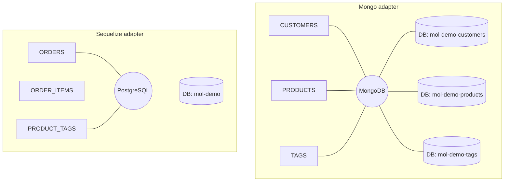
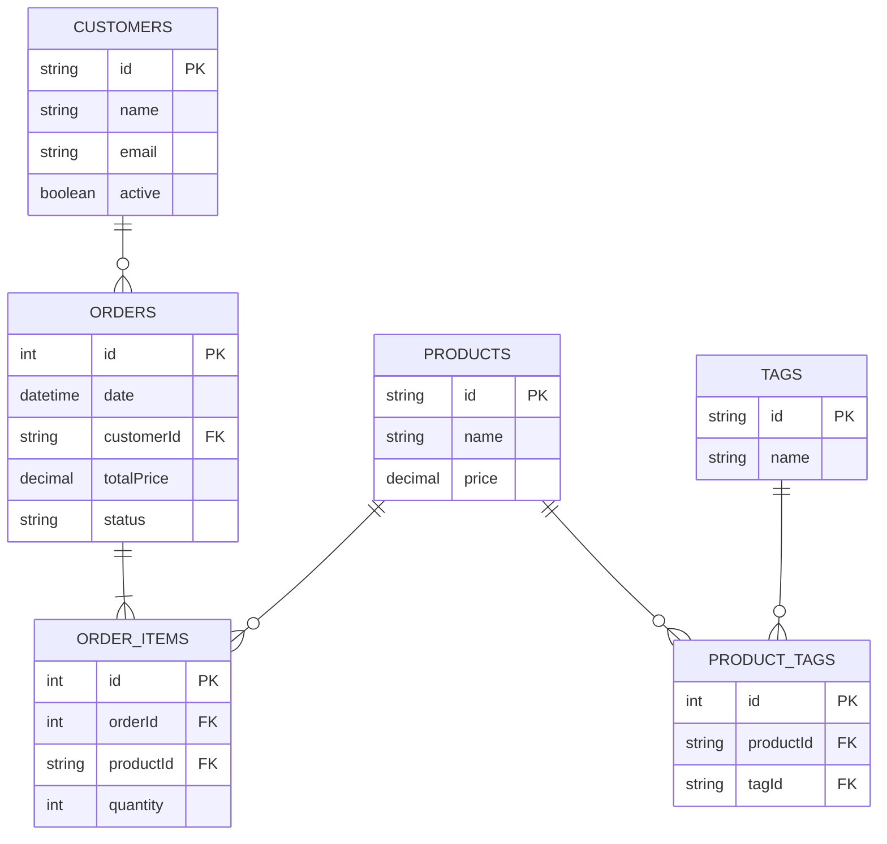

# Moleculer DB relations
This is a [Moleculer](https://moleculer.services/) demo project which demonstrates that how you can create database relations between moleculer-db services following the [one-database-per-service](https://microservices.io/patterns/data/database-per-service.html) microservices concept.

## Databases

This demo uses MongoDB and PostgreSQL in a mix in order to better demonstrate the power of populating between tables in different database engines.

### Customer service

https://github.com/icebob/moleculer-db-relations-demo/blob/c77985a6b950b014edf18b73e0083007559242de/services/customers.service.js#L1-L56

### Product service

https://github.com/icebob/moleculer-db-relations-demo/blob/c504eefa8b78f778388d3e3d4b4ad61791fdbb20/services/products.service.js#L1-L43

### Tag service

https://github.com/icebob/moleculer-db-relations-demo/blob/c504eefa8b78f778388d3e3d4b4ad61791fdbb20/services/tags.service.js#L1-L41

### Product-Tag service

https://github.com/icebob/moleculer-db-relations-demo/blob/c504eefa8b78f778388d3e3d4b4ad61791fdbb20/services/product-tags.service.js#L1-L56

### Order service

https://github.com/icebob/moleculer-db-relations-demo/blob/c504eefa8b78f778388d3e3d4b4ad61791fdbb20/services/orders.service.js#L1-L86

### Order item service

https://github.com/icebob/moleculer-db-relations-demo/blob/c504eefa8b78f778388d3e3d4b4ad61791fdbb20/services/order-items.service.js#L1-L59

### Diagram

## Relations

### Diagram
This diagram shows the relations between the services.

## One-to-many relation

The `orders` service `customerId` field a references to a `customers` entity, so it represents a one-to-many relation. 

## Useful links

* Moleculer website: https://moleculer.services/
* Moleculer Documentation: https://moleculer.services/docs/0.14/
* Microservices patterns: https://microservices.io/

<!-- 
https://github.com/ladal1/orm-comparison/tree/main/src/Packages

https://github.com/alfateam/rdb/tree/master#api
https://mikro-orm.io/docs/relationships
https://vincit.github.io/objection.js/guide/relations.html
https://typeorm.io/relations
 -->
