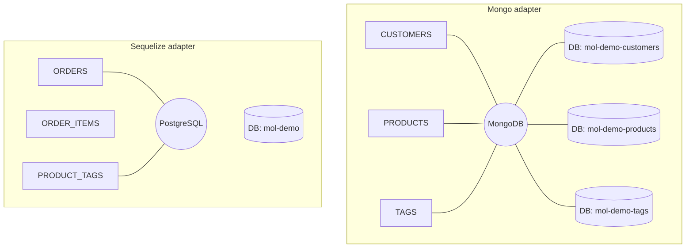
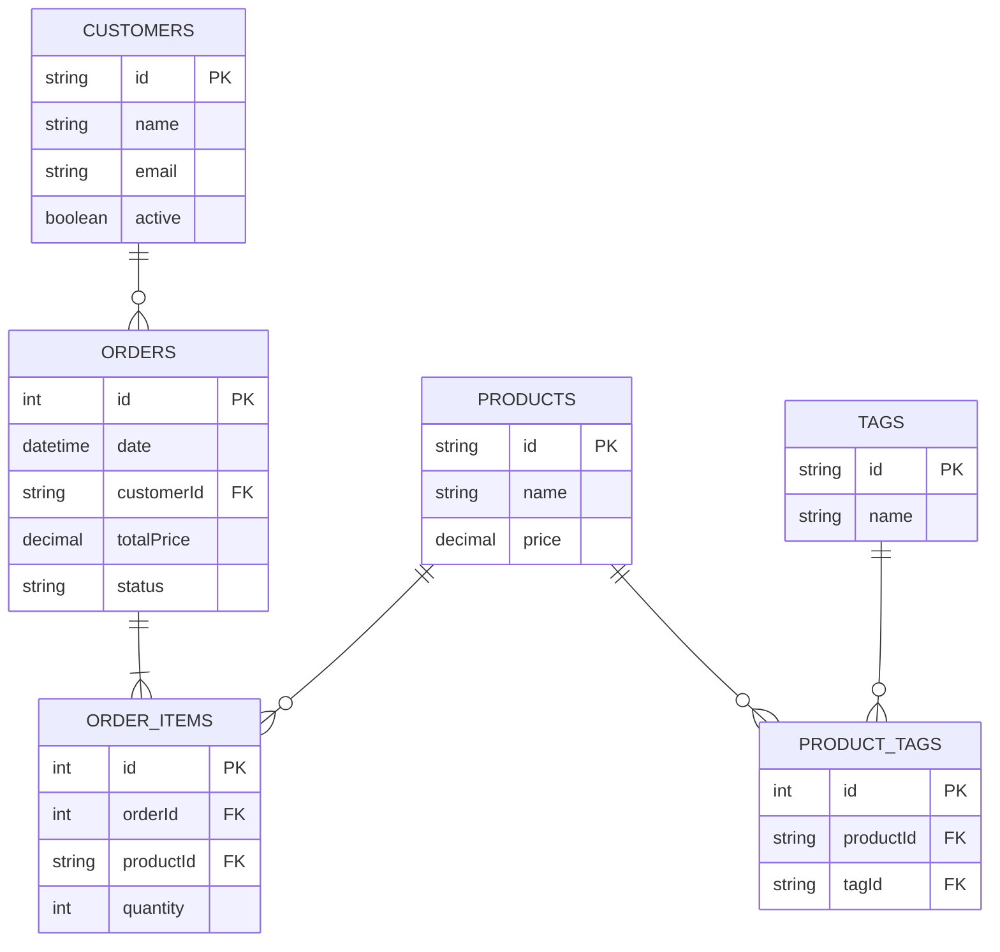

[](https://moleculer.services)

# Moleculer DB relations
This is a [Moleculer](https://moleculer.services/) demo project which demonstrates that how you can create database relations between moleculer-db services following the [one-database-per-service](https://microservices.io/patterns/data/database-per-service.html) microservices concept.

## Databases

This demo uses MongoDB and PostgreSQL in a mix in order to better demonstrate the power of populating between tables in different database engines.

### Customer service

https://github.com/icebob/moleculer-db-relations-demo/blob/c77985a6b950b014edf18b73e0083007559242de/services/customers.service.js#L1-L56

### Product service

https://github.com/icebob/moleculer-db-relations-demo/blob/c504eefa8b78f778388d3e3d4b4ad61791fdbb20/services/products.service.js#L1-L43

### Tag service

https://github.com/icebob/moleculer-db-relations-demo/blob/c504eefa8b78f778388d3e3d4b4ad61791fdbb20/services/tags.service.js#L1-L41

### Product-Tag service

https://github.com/icebob/moleculer-db-relations-demo/blob/c504eefa8b78f778388d3e3d4b4ad61791fdbb20/services/product-tags.service.js#L1-L56

### Order service

https://github.com/icebob/moleculer-db-relations-demo/blob/c504eefa8b78f778388d3e3d4b4ad61791fdbb20/services/orders.service.js#L1-L86

### Order item service

https://github.com/icebob/moleculer-db-relations-demo/blob/c504eefa8b78f778388d3e3d4b4ad61791fdbb20/services/order-items.service.js#L1-L59

### Diagram



## Relations

### Diagram
This diagram shows the relations between the services.



### One-to-many relation

The `orders` service `customerId` field a references to a `customers` entity, so it represents a one-to-many relation. 

In order to get the customer entity when listing orders, you should define a `customer` populate in `orders` service settings:

```js
module.exports = {
    name: "orders",
    
    settings: {
        fields: [
            // ...
            "customer",
            // ...
        ],

        // Populates for relations
        populates: {
            // ...

            // The `customerId` field references to a customer.
            customer: {
                field: "customerId",
                action: "customers.get",
                params: {
                    fields: ["name", "email"]
                }
            },

            // ...
        }
    }
};
```
> You can find similar populates to cover references of `orderItems -> products`, `product-tags -> products` or `product-tags -> tags`.

#### Opposite 
To demonstrate the opposite direction, we can define another populate to get the `orderItems` of the `order`. So we define an `items` populate which fetches all `orderItems` entity based on the `orderId` value. _It's like a sub-query_

```js
module.exports = {
    name: "orders",
    
    settings: {
        fields: [
            // ...
            "items",
            // ...
        ],

        // Populates for relations
        populates: {
            // ...

            // The `customerId` field references to a customer.
            /* Get the items from the `orderItems` service */
            async items(ids, orders, rule, ctx) {
                await Promise.all(orders.map(async order => {
                    order.items = await ctx.call("orderItems.find", {
                        query: {
                            orderId: order.id
                        }
                    });
                }));
            },

            // ...
        }
    }
};
```
> You can find similar populates to cover references of `product -> tags` or `customers -> orders`.

### Many-to-many relation

In this example, the product entity has multiple tags, and a tag has been assigned to multiple products, so it's a many-to-many relation which is covered with the `product-tags` service/table. 
>Please note that in this example the `products` and `tags` services use MongoDB database while `product-tags` uses PostgreSQL, but it doesn't matter because we use Moleculer DB populate feature to cover relations.

We create one-to-many relations in `product-tags` service referencing to `products` and `tags` entities:

```js
module.exports = {
    name: "product-tags",
    
    settings: {
        fields: [
            // ...
            "product",
            "tag",
            // ...
        ],

        // Populates for relations
        populates: {
            // The `productId` field references to a product.
            product: {
                field: "productId",
                action: "products.get",
                params: {
                    fields: ["name", "price"]
                }
            },

            // The `orderId` field references to an order.
            tag: {
                field: "tagId",
                action: "tags.get",
                params: {
                    fields: ["id", "name"]
                }
            }
        }
    }
};
```

In `products` service, we define a `tags` populate which collects the assigned tag names:

```js
module.exports = {
    name: "products",
    
    settings: {
        fields: [
            // ...
            "tags",
            // ...
        ],

        // Populates for relations
        populates: {
            // ...

            async tags(ids, products, rule, ctx) {
                await Promise.all(products.map(async prd => {
                    const res = await ctx.call("product-tags.find", {
                        query: {
                            productId: prd.id
                        },
                        // Second level populating for tag entity
                        populate: ["tag"]
                    });

                    prd.tags = res.map(item => item.tag.name);
                }));
            },

            // ...
        }
    }
};
```

And if necessary, we can define a `products` populate in `tags` service in order to collect products by tags:

```js
module.exports = {
    name: "tags",
    
    settings: {
        fields: [
            // ...
            "products",
            // ...
        ],

        // Populates for relations
        populates: {
            // ...

            async products(ids, tags, rule, ctx) {
                await Promise.all(tags.map(async prd => {
                    const res = await ctx.call("product-tags.find", {
                        query: {
                            tagId: prd.id
                        },
                        populate: ["product"]
                    });

                    prd.products = res.map(item => item.product);
                }));
            },

            // ...
        }
    }
};
```

### One-to-one relation
In this example there is no an exact one-to-one relation demo because you can cover it with the first one-to-many relation.

## Useful links

* Moleculer website: https://moleculer.services/
* Moleculer Documentation: https://moleculer.services/docs/0.14/
* Microservices patterns: https://microservices.io/

<!-- 
https://github.com/ladal1/orm-comparison/tree/main/src/Packages

https://github.com/alfateam/rdb/tree/master#api
https://mikro-orm.io/docs/relationships
https://vincit.github.io/objection.js/guide/relations.html
https://typeorm.io/relations
 -->
