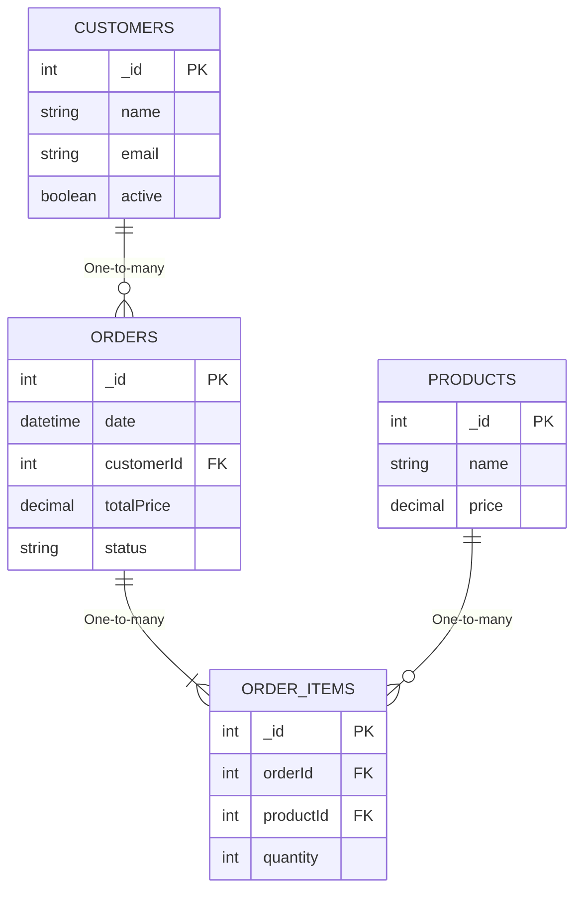

# moleculer-db-relations-demo
This is a [Moleculer](https://moleculer.services/) demo project which demonstrates that how you can create data relations between moleculer-db services following the one-database-per-service microservices concept.

## Relations

## Usage
Start the project with `npm run dev` command. 

## Useful links

* Moleculer website: https://moleculer.services/
* Moleculer Documentation: https://moleculer.services/docs/0.14/

<!-- 
https://github.com/ladal1/orm-comparison/tree/main/src/Packages

https://github.com/alfateam/rdb/tree/master#api
https://mikro-orm.io/docs/relationships
https://vincit.github.io/objection.js/guide/relations.html
https://typeorm.io/relations
 -->
